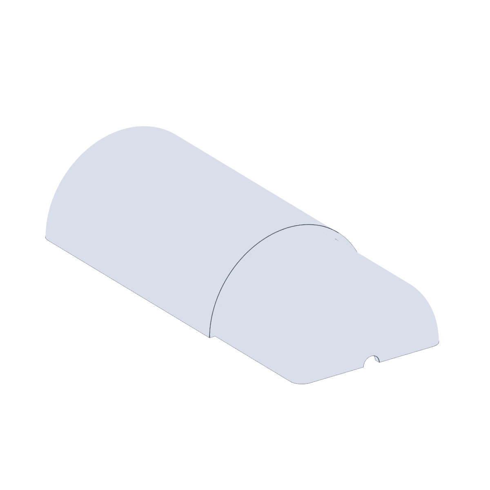
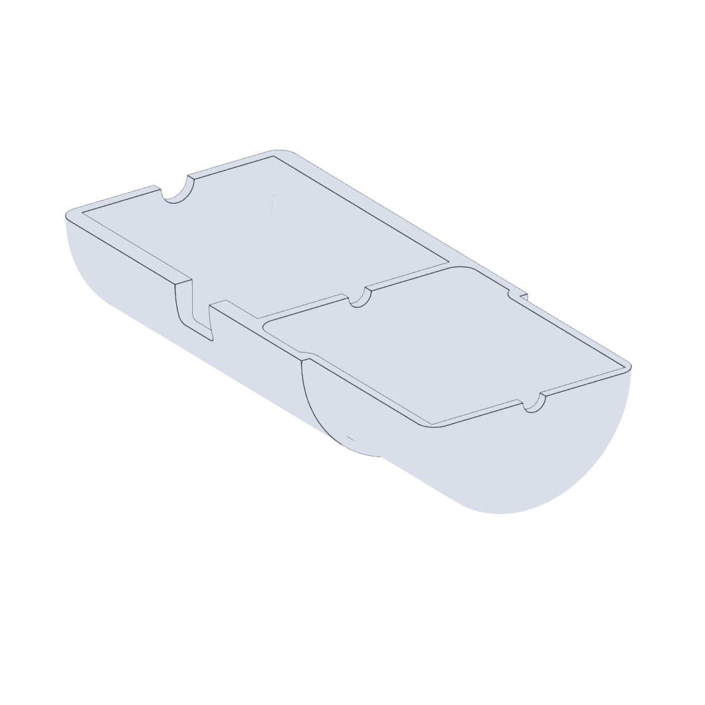
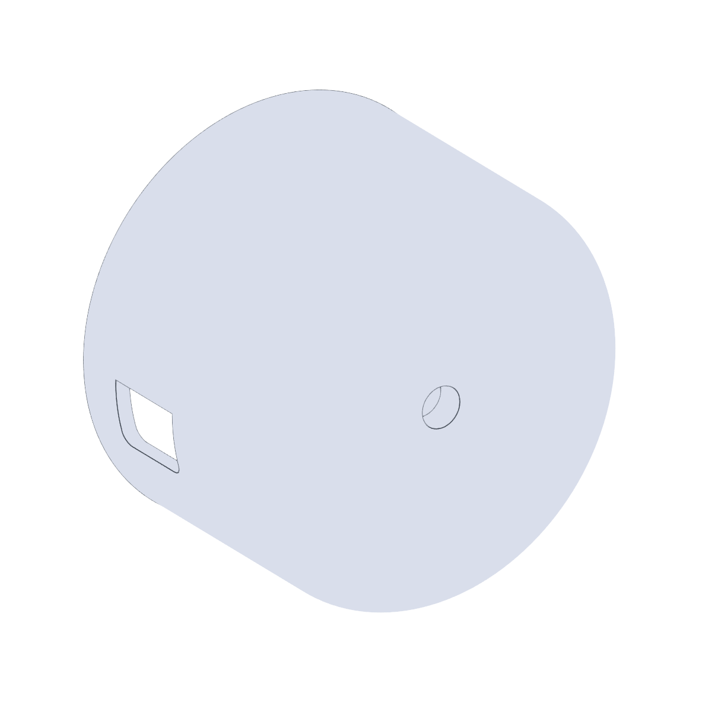

# ASMI Mounts (CubXL)

| Back | Front | Cap |
| --- | --- | --- |
|  |  |  |

3D-printed mounts for attaching a Vernier force sensor (and related ASMI
hardware) to the **CubXL** for the
[ASMI](https://github.com/BU-KABlab/ASMI_new) system.

## Files

| File | Purpose |
| --- | --- |
| `ForceSensorMountBack.stl` / `.step` | Back half of the sensor housing. |
| `ForceSensorMountFront.stl` / `.step` | Front half of the sensor housing. |
| `ForceSensorMountCap.stl` / `.step` | Cap that closes the housing once the sensor is seated. |
| `Vernier Go Direct Mount (Base)_REV. 3 (1).step` | Newer two-part Go Direct sensor mount — base. |
| `Vernier Go Direct Mount (Cover)_REV. 3 (1).step` | Newer two-part Go Direct sensor mount — cover. |
| `Heater Plate Holder_REV. 0.step` | Holder for the ASMI heater plate. |

Print all three ForceSensorMount parts; the `.step` files are the source
CAD if you need to modify the design. The REV. 0 Go Direct mount sized
for the Cub lives in
[`../../../cub/instrument_mounts/asmi/`](../../../cub/instrument_mounts/asmi/),
and the CubXL ASMI wellplate holder is under
[`../../labware/well_plate_holder/`](../../labware/well_plate_holder/).
