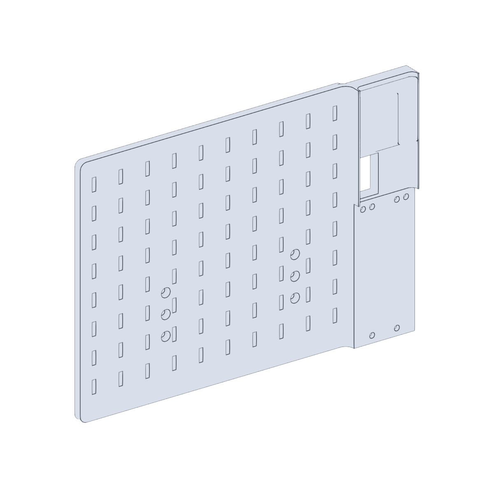
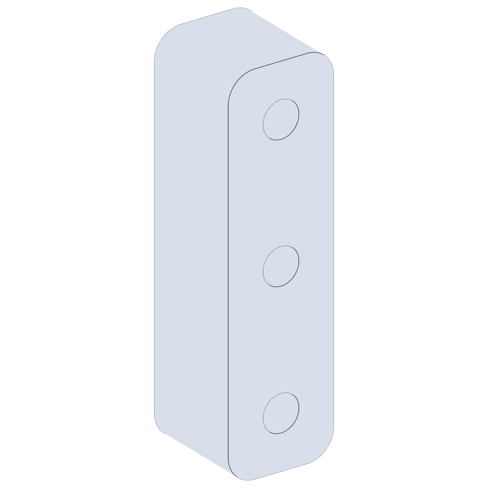

# OT2 Backboard

The OT2 backboard is the central mounting plate that bolts to the
Opentrons OT-2 frame and serves as the carrier for the other CubXL+
instrument mounts. The other PAW-V2 mounts in this directory all attach
to this backboard:

- [`../vial_capper_decapper_mount/`](../vial_capper_decapper_mount/) —
  electromagnet used to drive the vial capper/decapper.
- [`../raspberry_pi_mount/`](../raspberry_pi_mount/) —
  Raspberry Pi Camera Module 3 mount.
- [`../potentiostat_mount/`](../potentiostat_mount/) —
  ionic conductivity probe (potentiostat) mount.

## Files

| File | Purpose |
| --- | --- |
| `OT2Backboard.stl` | Backboard plate itself. |
| `Spacers.stl` | Spacers that set the standoff between the backboard and the OT-2 frame. |

## Previews

| Backboard | Spacers |
| --- | --- |
|  |  |
