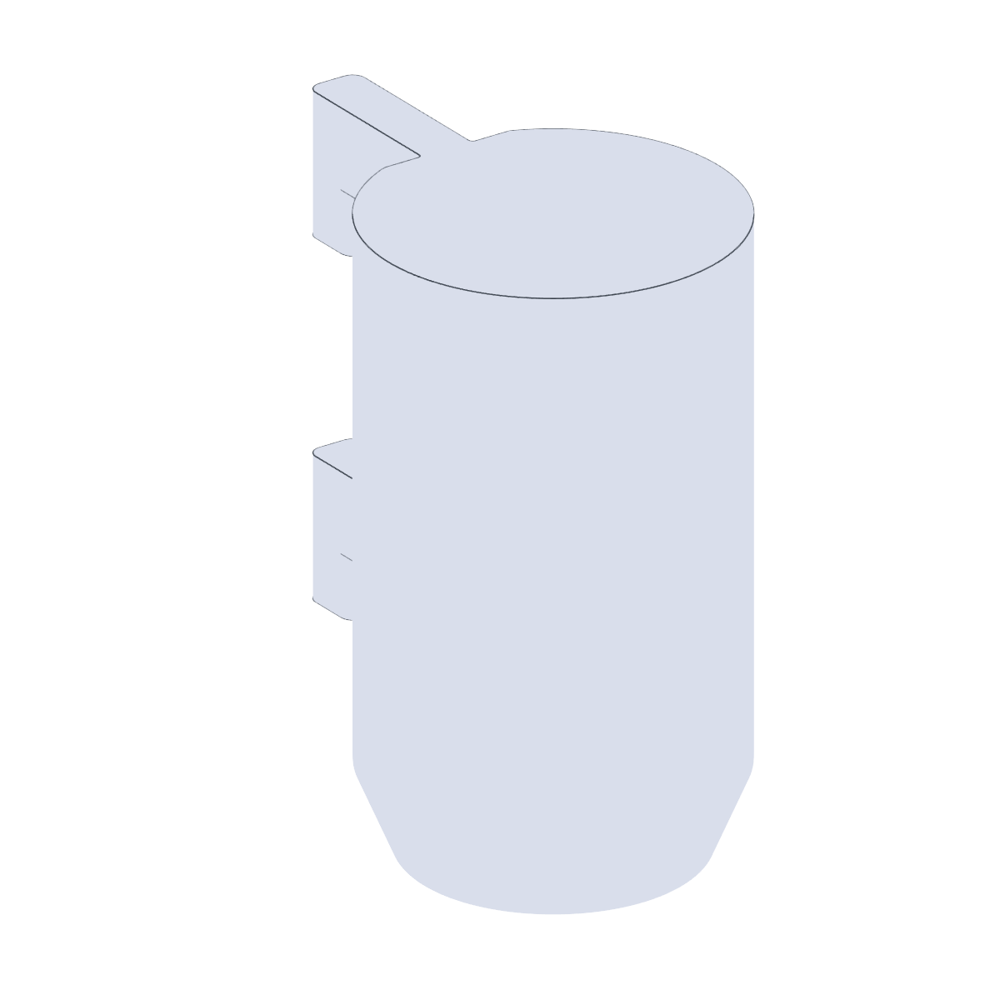

# Potentiostat (Ionic Conductivity Probe) Mount

Mount for the ionic conductivity probe read by the potentiostat. Bolts
onto the [OT2 backboard](../backboard/).

## Files

| File | Purpose |
| --- | --- |
| `IonicConductivityProbeMount.stl` | Printable probe holder. |
