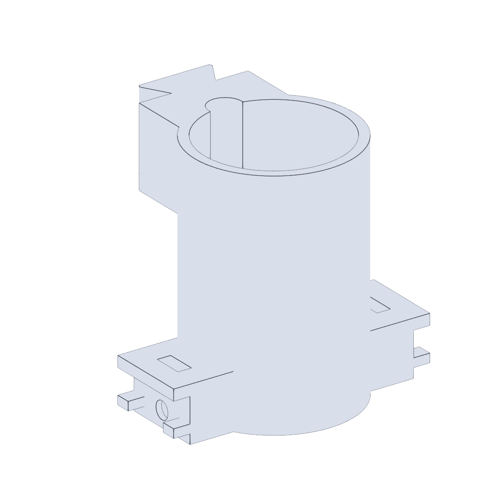

# Vial Decapper Mount

Mount that holds the electromagnet used to drive the vial
capper/decapper. Bolts onto the [OT2 backboard](../backboard/). See the
[Vial Capper / Decapper Build Guide](../../../documentation/vial-capper-decapper-build.md)
for the full assembly.

## Files

| File | Purpose |
| --- | --- |
| `VialDecapperMount.stl` | Printable electromagnet housing. |
