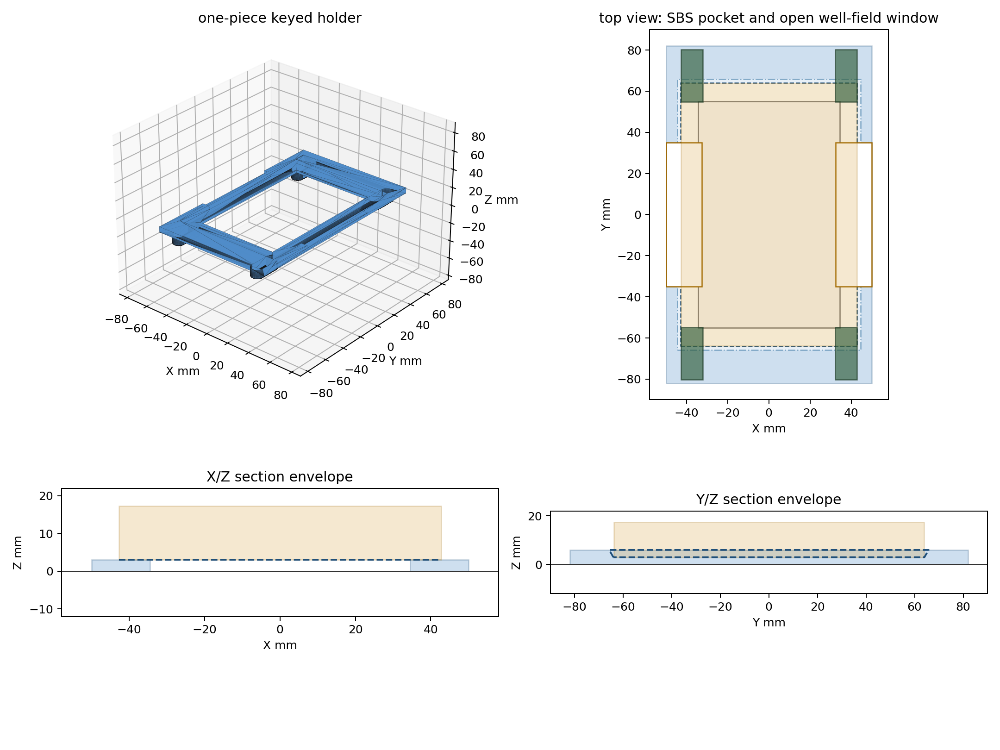

# Panda SBS Wellplate Holder



A keyed 3D-printed holder for seating a standard SBS/ANSI 96-well plate on
`cubxl_plus/deck/polycarbonate_deck/PandaDeck.step`.

This replaces the visually incompatible legacy `ursa_wellplate_holder` pattern
for the PandaDeck by using the same deck key geometry as
`../vial_holder/9VialHolder-key.step`.

## Files

| File | Purpose |
| --- | --- |
| `PandaSBSWellplateHolder.step` | Manufacturing/source CAD for the 6 mm holder with a 60 degree lead-in and 70 mm long-side gripper gaps. |
| `PandaSBSWellplateHolder.stl` | Printable mesh exported from the STEP, pre-oriented with the top/pocket face on the build plate and keys printed last. |
| `PandaSBSWellplateHolder.3mf` | Basic 3MF export of the printable mesh. |
| `PandaSBSWellplateHolder.gcode.3mf` | Sliced 3MF/G-code package for the current holder. |
| `PandaSBSWellplateHolder-deck-fit.step` | QA assembly: PandaDeck, keyed holder, and SBS plate envelope. |
| `PandaSBSWellplateHolder.png` | Holder geometry preview. |
| `PandaSBSWellplateHolder-deck-fit.png` | Visual deck-fit preview. |
| `PandaSBSWellplateHolder-print-orientation.png` | Visual preview of the STL print orientation. |
| `PandaSBSWellplateHolder.yaml` | CubOS-style labware metadata for the physical holder. |

## Geometry

- SBS plate footprint: 85.48 mm x 127.76 mm, oriented with the 12-column
  direction along deck Y.
- Pocket clearance: 0.30 mm total over the nominal SBS footprint.
- Holder body footprint: 100.0 mm x 164.0 mm.
- Plate underside seat height: 3.0 mm above the holder body bottom.
- Holder body height: 6.0 mm.
- Printed side-wall height above plate seat: 3.0 mm.
- Lead-in angle: 60 degrees from the horizontal seat plane.
- Tapered top opening: 89.24 mm x 131.52 mm, narrowing to the 85.78 mm x
  128.06 mm seated pocket.
- Long-side gripper gaps: centered 70.0 mm openings in both raised long-side
  rails. The 3.0 mm seat/base remains connected below those openings so the
  holder stays one printable solid.
- Plate rim/surface height: 17.35 mm above the holder body bottom.
- Deck keys: four integral copies of `9VialHolder-key.step`.
- Key layout: corners of a 4-by-4 PandaDeck insert block.

The pocket is intentionally tighter than a universal worst-case SBS carrier.
The previous generator used 0.65 mm total clearance; the SBS width constant was
also 0.01 mm under the nominal standard value, which is negligible compared
with the clearance. Use `--plate-clearance` if a specific printer/material or
plate vendor needs a looser pocket.

The generated deck-fit assembly places the local holder origin at deck
`(90.0, -112.5, 10.0)` so the four key centers land on these PandaDeck slots:

| Deck X | Deck Y |
| --- | --- |
| 52.5 | -45.0 |
| 127.5 | -45.0 |
| 52.5 | -180.0 |
| 127.5 | -180.0 |

## Printing

- Do not scale.
- Recommended material: PETG, ASA, or a dimensionally stable PLA+.
- `PandaSBSWellplateHolder.stl` is already oriented for printing: the
  top/pocket face is on the build plate and the four keys point upward so they
  are printed last. Use a brim if bed contact is marginal.
- Use at least 4 perimeters/walls and 30% infill for a rigid frame.
- If your printer shows elephant's-foot growth, use first-layer or XY
  compensation before judging deck-key fit.

## QA

Generated and checked with FreeCAD 1.0.2:

```bash
PYTHONPATH=/Applications/FreeCAD.app/Contents/Resources/lib \
  /Applications/FreeCAD.app/Contents/Resources/bin/python \
  tools/build_panda_sbs_wellplate_holder.py

PYTHONPATH=/Applications/FreeCAD.app/Contents/Resources/lib \
  /Applications/FreeCAD.app/Contents/Resources/bin/python \
  tools/render_panda_holder_previews.py

PYTHONPATH=/Applications/FreeCAD.app/Contents/Resources/lib \
  /Applications/FreeCAD.app/Contents/Resources/bin/python \
  tools/inspect_geometry.py \
  cubxl_plus/labware/well_plate_holder/PandaSBSWellplateHolder.step \
  cubxl_plus/labware/well_plate_holder/PandaSBSWellplateHolder.stl

PYTHONPATH=/Applications/FreeCAD.app/Contents/Resources/lib \
  /Applications/FreeCAD.app/Contents/Resources/bin/python \
  tools/check_panda_holder_fit.py
```

The CAD checker verifies:

- The STEP is one valid closed solid.
- The STL is a solid mesh.
- Holder/PandaDeck boolean intersection volume is 0.0 mm^3.
- SBS plate envelope/holder boolean intersection volume is 0.0 mm^3.
