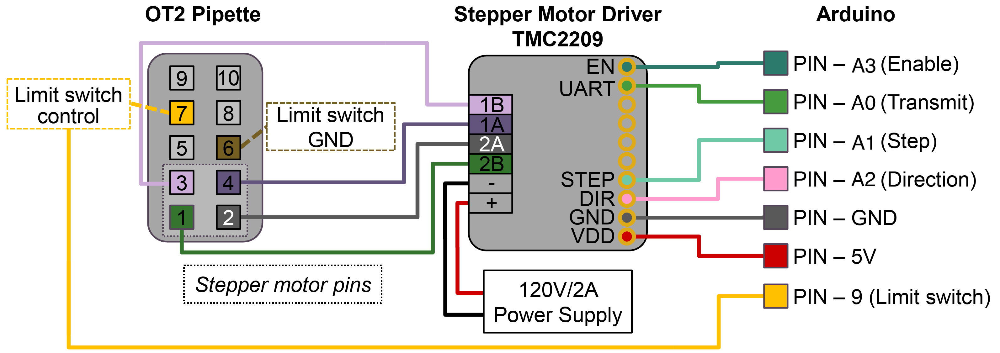

# Opentrons OT-2 Pipette Setup Guide

This page consolidates the current build, wiring, calibration, and CubOS
integration notes for using an Opentrons OT-2 electronic pipette on a PANDA/Cub
gantry. It covers the PAW/OT2 mechanical mount, Arduino stepper-control path,
tip rack expectations, and the CubOS implementation that maps the legacy
PANDA-BEAR OT2 pipette functions into current protocol commands.

## What The Pipette Setup Does

The setup mounts an Opentrons electronic pipette on the PAW/OT2 backboard and
drives the pipette plunger through the PANDA Arduino firmware. CubOS moves the
gantry to source, destination, tip-rack, and tip-disposal coordinates, then sends
serial commands to the Arduino for plunger actions such as home, aspirate,
dispense, blowout, mix, pick-up-tip, and drop-tip.

The CubOS code path is implemented, but the OT2 pipette hardware path has not
yet been validated on the physical machine in this checkout. Treat every
position, model constant, and serial command as a commissioning value until it
has been tested with the installed pipette, tip rack, and firmware.

## Standalone BOM

Quantities are for one OT-2 pipette station unless noted.

| Qty | Item | Use | Part number / spec | Source | Cost in repo |
| --- | --- | --- | --- | --- | --- |
| 1 | OT-2 single-channel electronic pipette | Liquid handling instrument | P300, `999-00003` in legacy BOM | [Opentrons](https://opentrons.com/products/single-channel-electronic-pipette-p20) | USD 2,750 |
| 1 | Arduino Uno SMD R3 | Serial control path to PAW firmware | `A000073` | [DigiKey](https://www.digikey.com/en/products/detail/arduino/A000073/3476357) | USD 26.30 |
| 1 | Adafruit TMC2209 stepper motor driver breakout | Drives the OT-2 pipette stepper motor | Adafruit `6121` | [Adafruit](https://www.adafruit.com/product/6121) | USD 17.90 |
| 1 | 10-pin socket/socket IDC cable, 6 in | Connection to the OT-2 pipette | Adafruit `370` | [Adafruit](https://www.adafruit.com/product/370) | USD 2.00 |
| 1 | Uno R3 proto shield or equivalent | PAW control circuitry | Legacy BOM used Adafruit `2077`; Cubware capper guide notes a generic Uno R3 protoshield alternative | [Adafruit](https://www.adafruit.com/product/2077) | USD 9.95 |
| 1 pack | Aluminum SMT heat sinks, 10-pack | Heat sink for the TMC2209 stepper driver | Adafruit `1515`, 0.27" x 0.27" x 0.14" | [Adafruit](https://www.adafruit.com/product/1515) | USD 4.95 |
| 1 set | Jumper wires | Arduino/protoshield wiring | Female-female `4447`, extension `4635`, male-male `4482` | [Adafruit 4447](https://www.adafruit.com/product/4447), [Adafruit 4635](https://www.adafruit.com/product/4635), [Adafruit 4482](https://www.adafruit.com/product/4482) | USD 9.95, USD 11.95, USD 9.95 |
| 1 | USB extension cable | Communication with PAW hardware | 10-15 ft USB extension, UPC `686878976212` | [Amazon](https://a.co/d/3PqFbSj) | USD 8.99 |
| 1 kit | M3-M6 bolt kit | Mounting hardware for PAW/backboard parts | Kwokker M3-M6 bolt kit, 20 sizes | [Amazon](https://www.amazon.com/gp/product/B0CLZC8SQ5/) | USD 23.99 |
| As needed | Opentrons-compatible tips | Disposable pipette tips | Match the installed pipette model and tip rack geometry | Opentrons or equivalent | Not listed |

## Printed / Fabricated Parts

| Qty | Part | File | Notes |
| --- | --- | --- | --- |
| 1 | OT2 backboard mount | [`../cubxl_plus/instrument_mounts/backboard/`](../cubxl_plus/instrument_mounts/backboard/) | Main backboard that bolts to the OT-2 frame and carries the PAW-V2 mounts |
| 1 set | OT2 mount spacers | [`../cubxl_plus/instrument_mounts/backboard/`](../cubxl_plus/instrument_mounts/backboard/) | Sets the backboard standoff from the OT-2 frame |
| 1 | Legacy PAW-V2 OT2 mount | [`../cubxl_plus/instrument_mounts/backboard/PAW-V2 - OT2Mount_REV. 1 - OT2Mount.stl`](../cubxl_plus/instrument_mounts/backboard/PAW-V2%20-%20OT2Mount_REV.%201%20-%20OT2Mount.stl) | Cubware STL copy of the legacy PANDA-BEAR OT2 mount |
| 1 | Tip rack | [`../cubxl_plus/labware/tip_rack_holder/`](../cubxl_plus/labware/tip_rack_holder/) | CubOS tip-rack labware definition includes `tip_length`, pickup slots, and consumed-tip tracking |
| 1 | Used-tip disposal target | CubOS deck YAML `tip_disposal` labware | Needed for `drop_tip` protocol commands |

## Mount The Pipette

1. Print the OT2 backboard and spacer parts from
   [`../cubxl_plus/instrument_mounts/backboard/`](../cubxl_plus/instrument_mounts/backboard/).
2. Bolt the backboard to the OT-2 frame and confirm the plate is rigid before
   adding the pipette.
3. Mount the Opentrons pipette with the PAW-V2 OT2 mount hardware.
4. Route the pipette cable and Arduino USB cable so they cannot enter the
   gantry travel envelope.
5. Install the tip rack and used-tip disposal target on the deck.
6. Confirm the pipette nozzle can reach the intended tip-rack, source, and
   destination positions without the pipette body, cable, or backboard colliding
   with the deck or neighboring tools.

The legacy PANDA-BEAR checkout contains only the OT2 mount STEP file and wiring
evidence for this assembly. It does not contain a full mechanical drawing with
all fastener lengths, cable clips, or installation dimensions.

## Wire The Arduino Control Path

The OT2 pipette is controlled by the PAW Arduino firmware, not by the Opentrons
robot API. CubOS talks to the Arduino over serial at `115200` baud by default.

Use the diagram as the current wiring reference for the Arduino/TMC2209/pipette
control interface. The legacy PANDA-BEAR wiring docs point to the external
[BU-KABlab/PANDA_Arduino](https://github.com/BU-KABlab/PANDA_Arduino)
repository for firmware source, pin assignments, and installation instructions.

### Attach the Heat Sink to the TMC2209

Before wiring the TMC2209 into the control circuit, fit it with the Adafruit
`1515` heat sink so the driver doesn't thermal-throttle or shut down under
sustained plunger moves:

1. Peel the adhesive backing off one heat sink from the Adafruit `1515` pack.
2. Center the heat sink, fins up, over the TMC2209's driver IC (the largest
   chip on the breakout) and press firmly for a few seconds to set the
   thermal tape.
3. Check that the fins clear the breakout's pin headers and don't foul the
   protoshield or neighboring components once seated.

Before running pipette commands:

1. Flash the PAW Arduino firmware that supports the pipette command set.
2. Connect the Arduino to the CubOS host.
3. Identify the serial port, for example `/dev/ttyUSB0`, `/dev/ttyACM0`, or a
   macOS `/dev/tty.usb*` device.
4. Confirm no other process has the serial port open.
5. Keep the pipette clear of tips, liquids, and deck fixtures for the first
   home/status checks.
