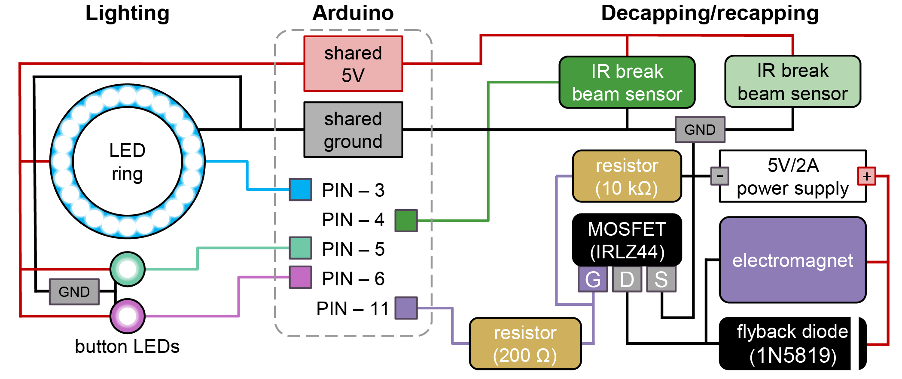

# Vial Capper / Decapper Build Guide

This page consolidates the current build, wiring, calibration, and validation
notes for the PANDA vial capper / decapper. It covers the custom magnetic vial
caps, the deck vial holder, the PAW-mounted electromagnet, the cap-presence
line-break sensor, and the software checks that prove the mechanism works.

## What The Mechanism Does

The decapper is a PAW tool that uses an electromagnet to pick up a custom vial
cap, lift it off a vial, and later release it back onto the vial. The cap
itself is 3D printed, filled with cured PDMS, and topped with a thin ferrous
metal disc so the electromagnet can hold it.

For PANDA units with `PANDA.version > 1.0`, production capping/decapping code
checks a line-break sensor after each operation. A broken line means the cap is
being held by the decapper; an unbroken line means the cap is not present at the
decapper.

## Standalone BOM

Quantities are for one PANDA vial capper / decapper station unless noted. The
local PANDA BOM does not specify quantities for every PAW subcomponent, so rows
marked "as needed" should be sized to the number of caps/vials or to the
existing PAW build.

### Purchased Parts

| Qty | Item | Use | Part number / spec | Source | Cost in repo |
| --- | --- | --- | --- | --- | --- |
| 1 | Electromagnet | Picks up the ferrous disc in the cap | uxcell 5V 50N; verify part number on listing | [Amazon](https://www.amazon.com/dp/B01NCVII18) | Verify on listing |
| 1 | IR break beam sensor, 5 mm LEDs | Detects whether a cap is present on the decapper | Adafruit 2168 | [Adafruit](https://www.adafruit.com/product/2168) | USD 5.99 |
| 1 | Arduino Uno SMD R3 | Controls PAW peripherals, including the electromagnet and line-break sensor | A000073 | [DigiKey](https://www.digikey.com/en/products/detail/arduino/A000073/3476357) | USD 26.30 |
| 1 | Uno R3 proto shield, generic | PAW control circuitry | HiLetgo Uno R3 ProtoShield with SYB-170 mini breadboard, 2-pack | [Amazon](https://www.amazon.com/dp/B00HHYBWPO) | Verify on listing |
| 1 | MOSFET | Switches the electromagnet from the Arduino control signal | IRLZ44 | [Amazon](https://www.amazon.com/dp/B0CBKH4XGL) | USD 9.99 |
| 1 each | Resistors | Electromagnet circuit | 10 kOhm and 200 Ohm | Not specified | Not listed |
| 1 | Flyback diode | Protects the electromagnet circuit | 1N5819 | [Amazon](https://www.amazon.com/dp/B079KG1TN2) | USD 7.99 |
| 1 set | Jumper wires | Arduino/protoshield wiring | Female-female 4447, extension 4635, male-male 4482 | [Adafruit 4447](https://www.adafruit.com/product/4447), [Adafruit 4635](https://www.adafruit.com/product/4635), [Adafruit 4482](https://www.adafruit.com/product/4482) | USD 9.95, USD 11.95, USD 9.95 |
| 1 | USB extension cable | Communication with PAW hardware | 10-15 ft USB extension, UPC 686878976212 | [Amazon](https://a.co/d/3PqFbSj) | USD 8.99 |
| 1 kit | M3-M6 bolt kit | Mounting hardware for PAW components | Kwokker M3-M6 bolt kit, 20 sizes | [Amazon](https://www.amazon.com/gp/product/B0CLZC8SQ5/) | USD 23.99 |
| As needed | 20 mL stock vials | Vials used with the custom magnetic caps | Fisher 12-100-112 | [Fisher Sci](https://www.fishersci.com/shop/products/clear-voa-glass-vials-0-125in-septa/12-100-112) | Not listed |
| 1 per cap | Adhesive-backed ferrous metal disc | Magnetic target on each custom cap | 25 mm diameter, 0.5 mm height | [Amazon example](https://www.amazon.com/Metal-inch-Replacement-32-Mini/dp/B0CJZ7SLJN/) | Not listed |
| About 2.6 mL per cap | PDMS base and crosslinker | Cured cap insert/seal | 10:1 base:crosslinker | Not specified | Not listed |
| Optional | Super glue | Secures ferrous disc if its adhesive is insufficient | Not specified | Not specified | Not listed |

### Printed / Fabricated Parts

| Qty | Part | File | Notes |
| --- | --- | --- | --- |
| 1 per capped vial, plus spares | Custom 16 mm vial cap | [`3D-prints/VialCap/VialCap16mm.step`](https://github.com/BU-KABlab/PANDA-BEAR/blob/main/documentation/3D-prints/VialCap/VialCap16mm.step) | Print at 0.2 mm layer height; fill with PDMS and add ferrous disc |
| 1 | 20 mL vial holder | [`3D-prints/DeckAccessories/9VialHolder20mL_TightFit.step`](https://github.com/BU-KABlab/PANDA-BEAR/blob/main/documentation/3D-prints/DeckAccessories/9VialHolder20mL_TightFit.step) | Holds vials along the Y-axis |
| 2 | Vial holder pill pins | [`3D-prints/DeckAccessories/9VialHolder20mL_TightFit - Pill.step`](https://github.com/BU-KABlab/PANDA-BEAR/blob/main/documentation/3D-prints/DeckAccessories/9VialHolder20mL_TightFit%20-%20Pill.step) | Construction guide says two are needed to place the holder on the deck |
| 1 | PAW electromagnet mount | [`3D-prints/PAW/PAW-V2 - ElectromagnetMount.step`](https://github.com/BU-KABlab/PANDA-BEAR/blob/main/documentation/3D-prints/PAW/PAW-V2%20-%20ElectromagnetMount.step) | Mounts the electromagnet to the PAW |
| Existing PAW build | PAW body and neighboring tool mounts | [`3D-prints/PAW/`](https://github.com/BU-KABlab/PANDA-BEAR/tree/main/documentation/3D-prints/PAW/) | The capper/decapper assumes the PAW is installed on the gantry |

The closest Cubware part pages are the [vial decapper mount](../mounts/vial_decapper_mount/)
and [9-vial holder](../labware/ursa_vial_holder/). The legacy PANDA build
assets listed above came from the PANDA-BEAR documentation tree.

## Fabricate The Custom Vial Caps

1. Print [`VialCap16mm.step`](https://github.com/BU-KABlab/PANDA-BEAR/blob/main/documentation/3D-prints/VialCap/VialCap16mm.step)
   at 0.2 mm layer height using the default Bambu Studio profile.
2. If the recessed geometry prints poorly, reduce print speed by 25%.
3. Mix PDMS at 10:1 base:crosslinker.
4. Add about 2.6 mL of mixed PDMS to each cap. The cap has a slightly recessed
   interior fill line.
5. Cure for at least 48 hours. Do not use caps while tacky.
6. If the cap is still tacky after two days, rinse repeatedly with water until
   it is no longer tacky.
7. Place a 25 mm diameter x 0.5 mm adhesive-backed ferrous metal disc into the
   cap's recessed top area.
8. If the disc adhesive is not strong enough, secure it with super glue.
9. Confirm the metal disc is flush with the cap top. No edge or section should
   protrude.

Use caps only for the same solution composition. Some solutions degrade caps
faster than others, so confirm each cap can still be removed by hand before
starting a campaign.

## Install The Vial Holder

1. Print the 20 mL vial holder and two pill pins from the deck accessory files
   listed above.
2. Mount the vial holder on the deck with the pill pins.
3. Place vials along the Y-axis. The construction guide says the first vial has
   the lowest Y value.
4. Calibrate vial locations through the mill calibration menu. The current
   calibration code uses 33.0 mm spacing between vials in the Y-axis when
   recalculating a full holder from the first vial.

## Build And Wire The Decapper

1. Mount the electromagnet to the PAW using the PAW electromagnet mount from
   [`3D-prints/PAW/`](https://github.com/BU-KABlab/PANDA-BEAR/tree/main/documentation/3D-prints/PAW/).
2. Wire the electromagnet through the Arduino-controlled MOSFET circuit with a
   flyback diode. The external firmware currently defines the electromagnet
   output as PWM-capable Arduino Uno pin `11` in `include/Magnet.h`.
3. Install the IR break beam sensor so a cap held by the decapper breaks the
   beam. The external firmware currently defines the line-break sensor input as
   Arduino Uno pin `4` in `include/LineBreak.h`, enables the internal pullup,
   and treats `LOW` as beam broken.
4. Connect the Arduino to the PANDA computer and set the serial port in the
   config.

The repository does not include exact electromagnet mounting dimensions in this
checkout. The PANDA [Arduino wiring guide](https://github.com/BU-KABlab/PANDA-BEAR/blob/main/documentation/Arduino-Wiring.md)
points to the separate
[BU-KABlab/PANDA_Arduino](https://github.com/BU-KABlab/PANDA_Arduino)
firmware repository for firmware, schematics, pin assignments, and installation
instructions.

### Wiring Diagram

This diagram is copied from the PANDA Arduino wiring documentation and shows the
Arduino control system used by the capper/decapper hardware.

## Arduino Firmware Details

The external [BU-KABlab/PANDA_Arduino](https://github.com/BU-KABlab/PANDA_Arduino)
repository currently describes itself as firmware for the PANDA Arduino and uses
PlatformIO with:

- `board = uno`
- `framework = arduino`
- `SERIAL_BAUD = 115200`
- Adafruit NeoPixel, ezButton, Adafruit Motor Shield V2, Adafruit PWM Servo
  Driver, AccelStepper, Adafruit BusIO, and TMC2209 dependencies

The firmware entry point `src/pawduino_v2.1.cpp` initializes the interface,
lights, magnet, line-break sensor, and pipette. It also calls
`checkMagnetTimer()` in the main loop. `include/Magnet.h` defines
`MAGNET_TIMER_DURATION` as 5 minutes, so the electromagnet should auto-off after
that duration if left energized.

The firmware's magnet module supports direct duty control, percent control,
full-on/full-off helpers, and `grabCap(holdPct, grabMs)`, which uses a
full-power pickup burst and then drops to a hold duty. The local PANDA-BEAR
Python control path currently uses command `5` (`CMD_EMAG_ON`) through
`no_cap()` and command `6` (`CMD_EMAG_OFF`) through `ALL_CAP()`.

## Arduino Control Contract

Integration into CubOS is in progress.
