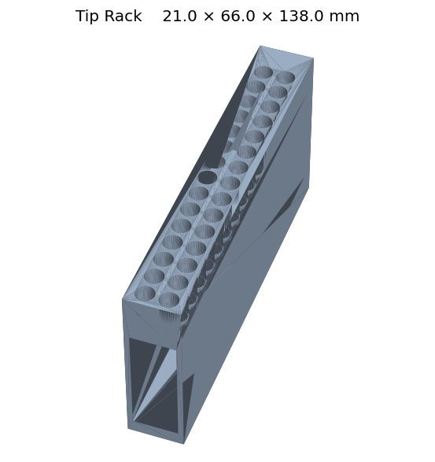

# Pipette Tip Rack



A 3D-printed rack for holding disposable pipette tips on the PANDA-BEAR deck.
Maps to `cubos.src.deck.labware.tip_rack.TipRack`, which inherits from
`HolderLabware` and exposes a per-tip `tip_present` boolean flag for tracking
which tips are still loaded vs. consumed.

## Files

| File | Purpose |
| --- | --- |
| `TipRack.stl` | Printable mesh of the tip rack. |
| `TipRack.glb` | Web/local 3D preview. |
| `TipRack.png` | Static preview image. |
| `TipRack.yaml` | Labware config mapping to `TipRack`. Placeholder tip layout — fill in before use. |

## Assembly

1. 3D-print `TipRack.stl`.
2. Place on the deck in the intended tip-rack slot.

## Compatibility

- Deck: PANDA-BEAR **Cub-XL only** (does not fit the Cub deck)

## Previewing the 3D model

The `.glb` file can be opened in:

- macOS Finder Quick Look (spacebar)
- VS Code with a glTF viewer extension
- Any browser via the `index.html` page in the parent directory
  (`python -m http.server 8000` then open `http://localhost:8000/`)

## Regenerating the GLB file

From the parent directory:

```bash
python step_to_glb.py ursa_tip_rack
```
