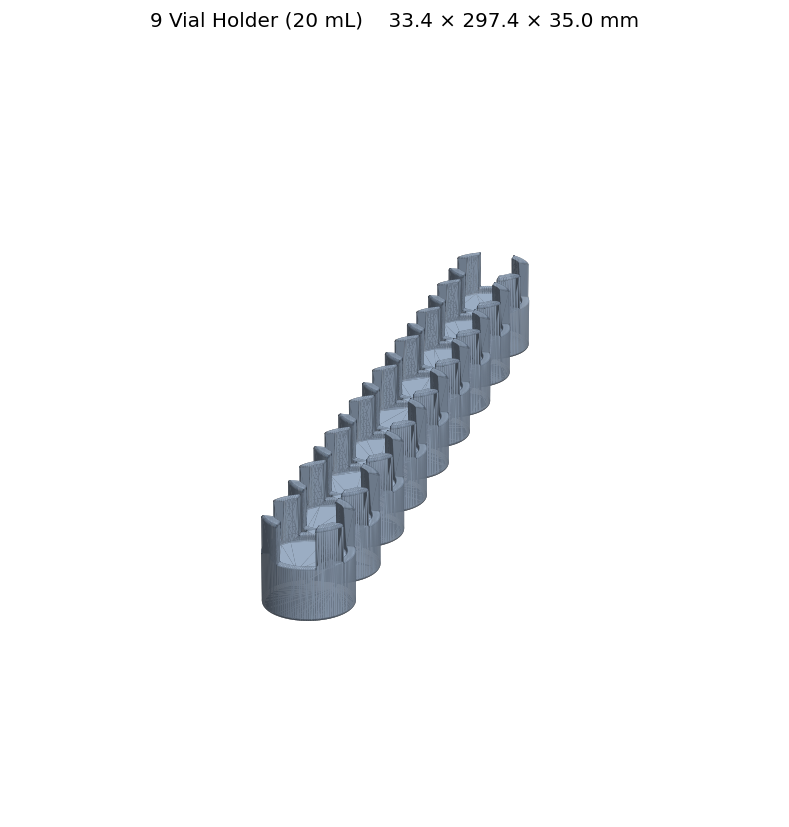
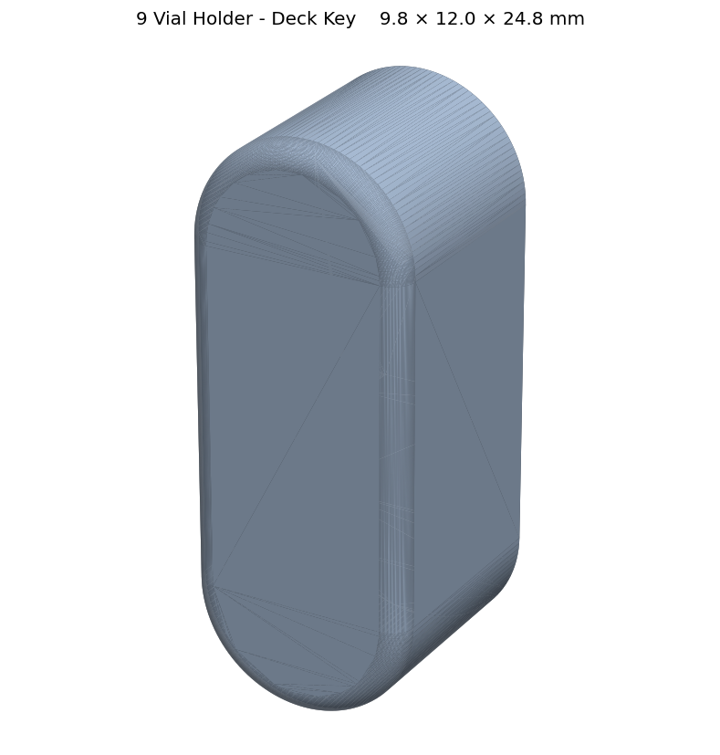

# 9-Vial Holder (20 mL)

| Holder | Key |
| --- | --- |
|  |  |

A 3D-printed deck accessory that holds nine standard 20 mL vials on the
PANDA-BEAR **Cub-XL** deck.

## Files

| File | Purpose |
| --- | --- |
| `9VialHolder.step` | The main holder body. Tight-fit cavities for nine standard 20 mL vials. |
| `9VialHolder-key.step` | A small "key" insert that locks the holder into place on the Cub-XL deck. |
| `9VialHolder.glb` | Web/local 3D preview of the holder. |
| `9VialHolder-key.glb` | Web/local 3D preview of the key insert. |

## Assembly

1. 3D-print both `.step` files.
2. Superglue the printed **key** into the matching slot on the **holder**.
3. Snap the assembled holder onto the Cub-XL deck.

The key is what keeps the holder locked to the deck, so make sure the glue
joint is fully cured before loading vials.

## Compatibility

- Vials: standard 20 mL (tight fit — no adapters needed)
- Deck: PANDA-BEAR **Cub-XL only** (does not fit the Cub deck)

## Previewing the 3D models

The `.glb` files can be opened in:

- macOS Finder Quick Look (spacebar)
- VS Code with a glTF viewer extension
- Any browser via the `index.html` page in the parent directory
  (`python -m http.server 8000` then open `http://localhost:8000/`)

## Regenerating the GLB files

From the parent directory:

```bash
python step_to_glb.py ursa_vial_holder
```

See `../step_to_glb.py` for options (tessellation tolerance, batch mode, etc.).
