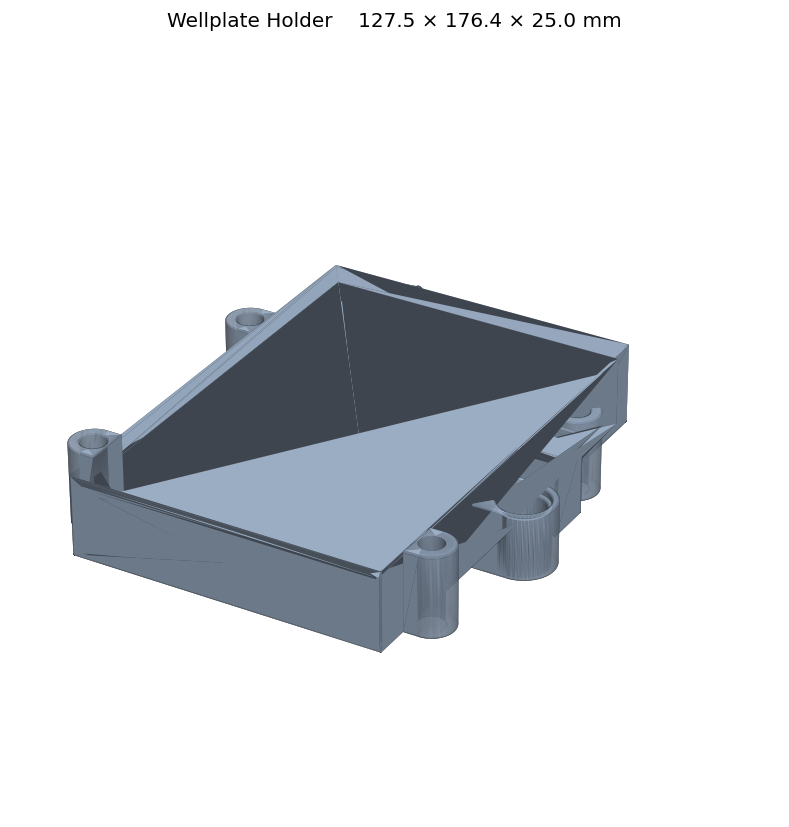

# Wellplate Holder



A 3D-printed holder for seating a standard wellplate on the PANDA-BEAR deck.
This model is the Filmetrics-compatible variant, used when the plate needs to
be positioned for film-thickness measurements.

## Files

| File | Purpose |
| --- | --- |
| `WellplateHolder.stl` | Printable mesh of the wellplate holder. |
| `WellplateHolder.glb` | Web/local 3D preview. |

## Assembly

1. 3D-print `WellplateHolder.stl`.
2. Place on the deck in the intended wellplate slot.
3. Drop the wellplate into the holder cavity.

## Compatibility

- Deck: PANDA-BEAR **Cub only** (does not fit the Cub-XL deck)
- For the Cub-XL variant see `../ursa_wellplate_holder_conductive/`.

## Previewing the 3D model

The `.glb` file can be opened in:

- macOS Finder Quick Look (spacebar)
- VS Code with a glTF viewer extension
- Any browser via the `index.html` page in the parent directory
  (`python -m http.server 8000` then open `http://localhost:8000/`)

## Regenerating the GLB file

From the parent directory:

```bash
python step_to_glb.py ursa_wellplate_holder
```
