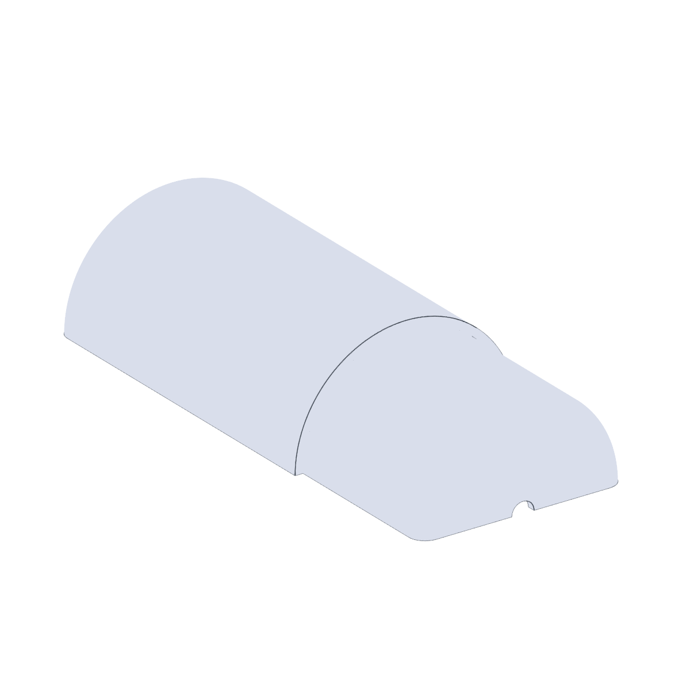
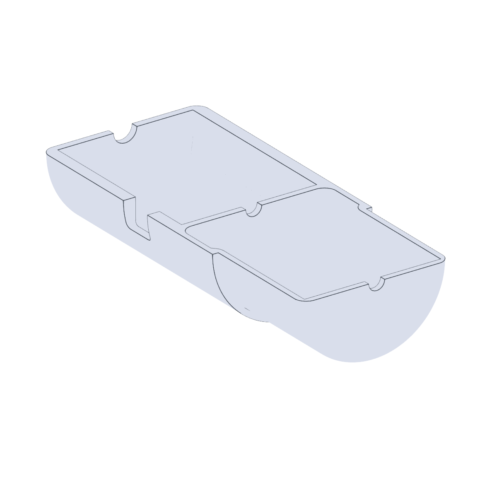
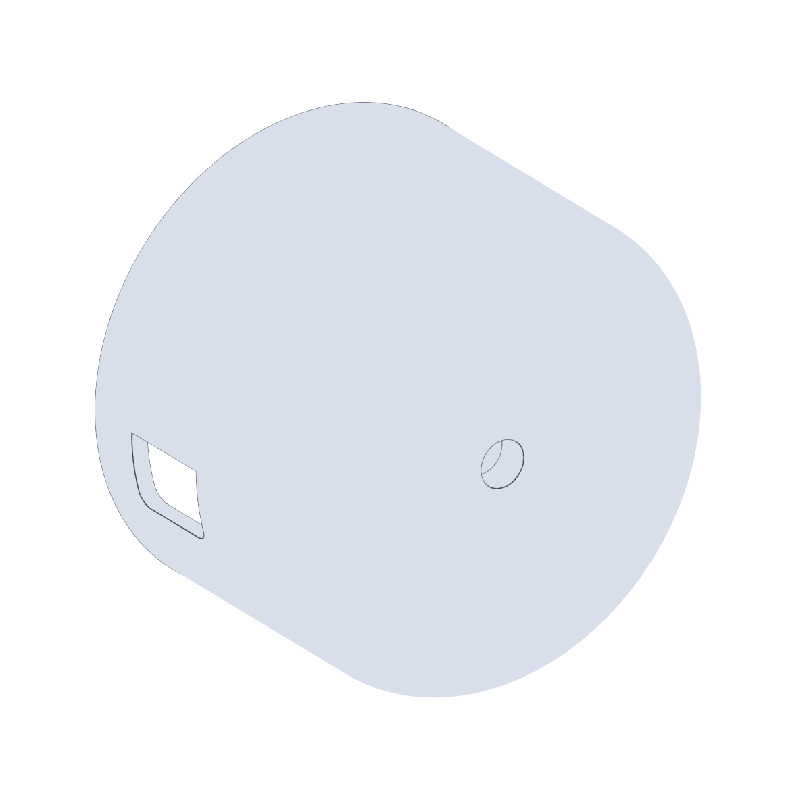

# ASMI Vernier Force Sensor Mount

| Back | Front | Cap |
| --- | --- | --- |
|  |  |  |

3D-printed mount for attaching a Vernier force sensor to the
[ASMI](https://github.com/BU-KABlab/ASMI_new) system.

## Files

| File | Purpose |
| --- | --- |
| `ForceSensorMountBack.stl` / `.step` | Back half of the sensor housing. |
| `ForceSensorMountFront.stl` / `.step` | Front half of the sensor housing. |
| `ForceSensorMountCap.stl` / `.step` | Cap that closes the housing once the sensor is seated. |

Print all three; the `.step` files are the source CAD if you need to
modify the design.
