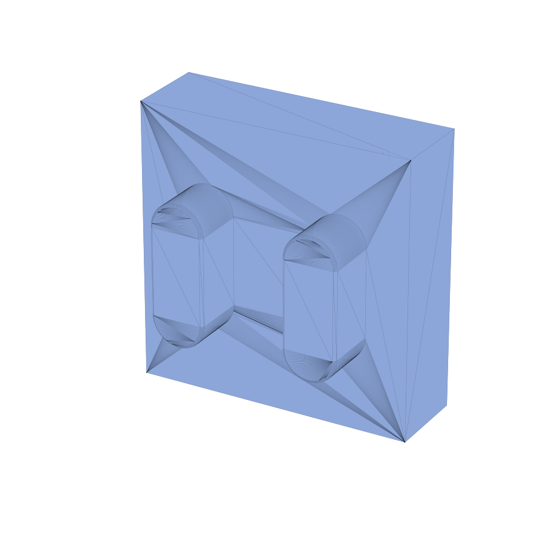
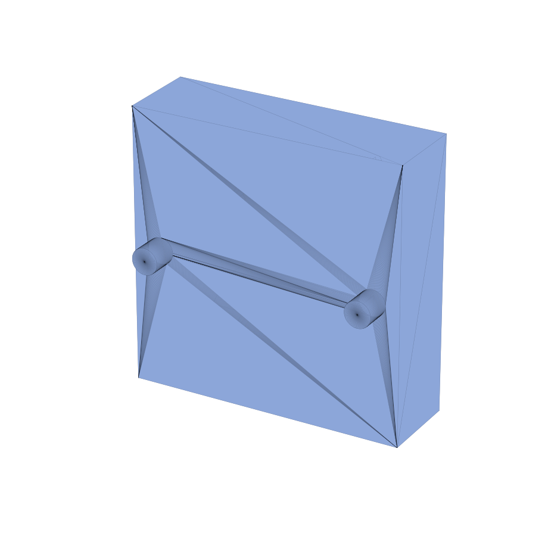
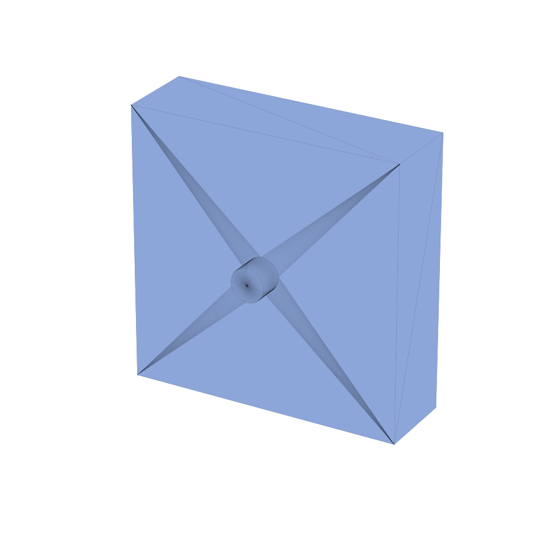
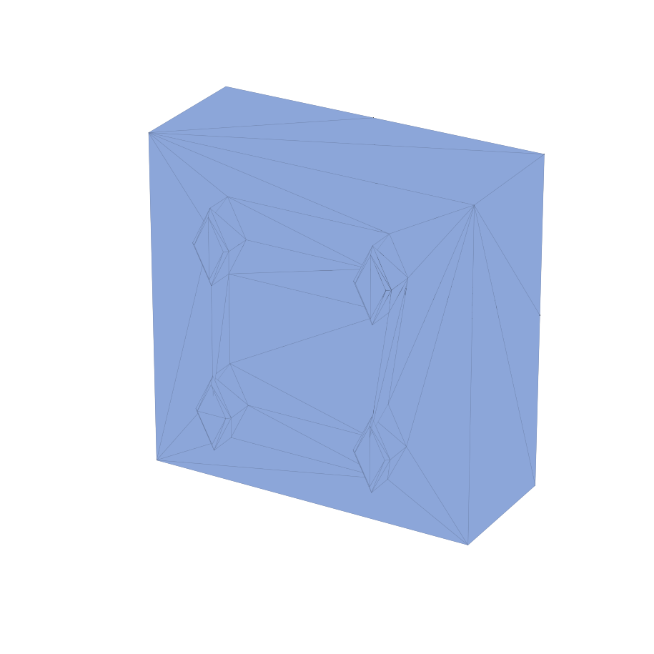

# Calibration Bases and Block

3D-printed calibration hardware: three base plates plus a calibration
block, used for establishing reference positions when setting up a Cub
system.

## Files

| File | Purpose |
| --- | --- |
| `Opentrons Calibration Base 1 - Part 1.stl` | Calibration base, variant 1. |
| `Opentrons Calibration Base 2 - Part 1.stl` | Calibration base, variant 2. |
| `Opentrons Calibration Base 3 - Part 1.stl` | Calibration base, variant 3. |
| `Opentrons Calibration Block - Part 1.stl` | Calibration block. |

## Previews

| Base 1 | Base 2 | Base 3 | Block |
| --- | --- | --- | --- |
|  |  |  |  |
