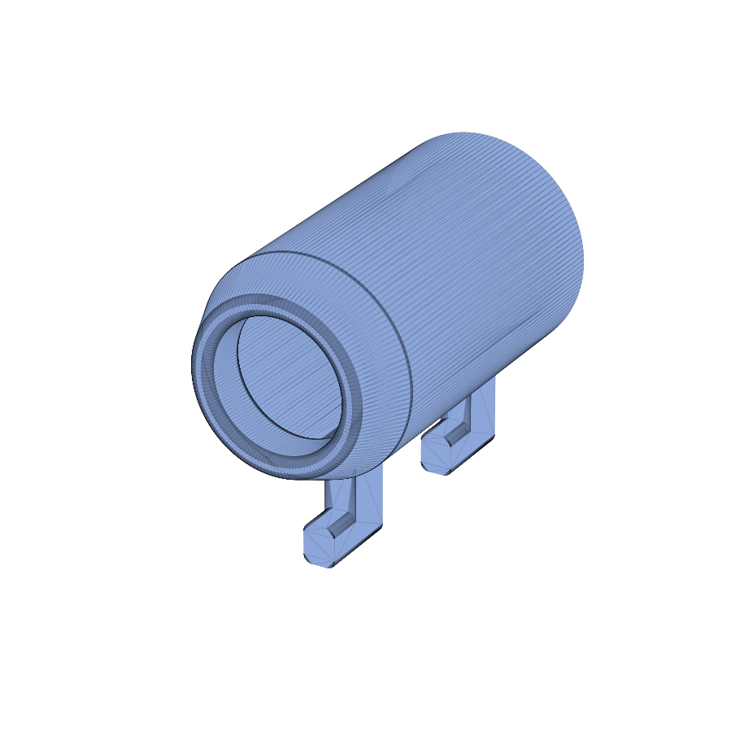

# Ionic Conductivity Probe Mount

Mount for an ionic conductivity probe. Bolts onto the
[OT2 backboard](../ot2_backboard/).

## Files

| File | Purpose |
| --- | --- |
| `PAW-V2 - Ionic Conductivity Probe Mount_REV. 0 - Part 1.stl` | Printable probe holder (REV. 0). |
