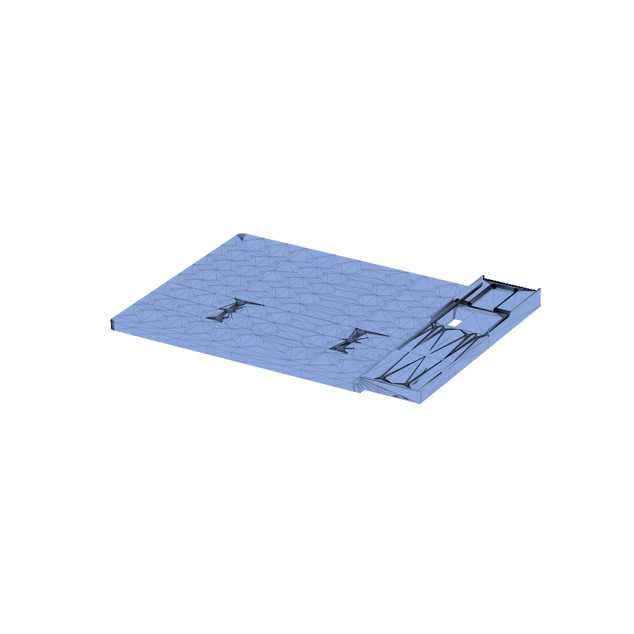
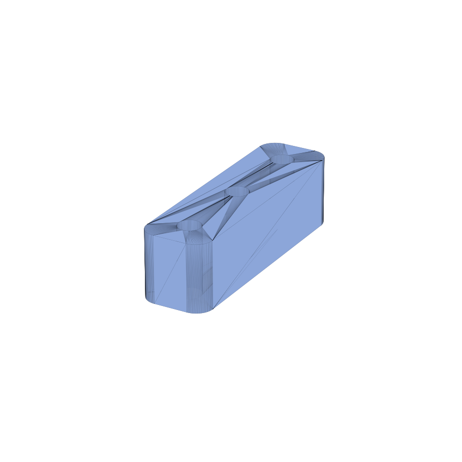

# OT2 Backboard

The OT2 backboard is the central mounting plate that bolts to the
Opentrons OT-2 frame and serves as the carrier for everything else in
this directory. The other PAW-V2 mounts in `mounts/` all attach to this
backboard:

- [`../vial_decapper_mount/`](../vial_decapper_mount/) — electromagnet
  used to drive the vial decapper.
- [`../raspberry_pi_camera_mount/`](../raspberry_pi_camera_mount/) —
  Raspberry Pi Camera Module 3 mount.
- [`../ionic_conductivity_probe_mount/`](../ionic_conductivity_probe_mount/) —
  ionic conductivity probe mount.

## Files

| File | Purpose |
| --- | --- |
| `PAW-V2 - OT2Mount_REV. 1 - OT2Mount.stl` | Backboard plate itself (REV. 1). |
| `PAW-V2 - OT2Mount Spacers_REV. 0 - OT2Mount.stl` | Spacers that set the standoff between the backboard and the OT-2 frame. |

## Previews

| Backboard | Spacers |
| --- | --- |
|  |  |
