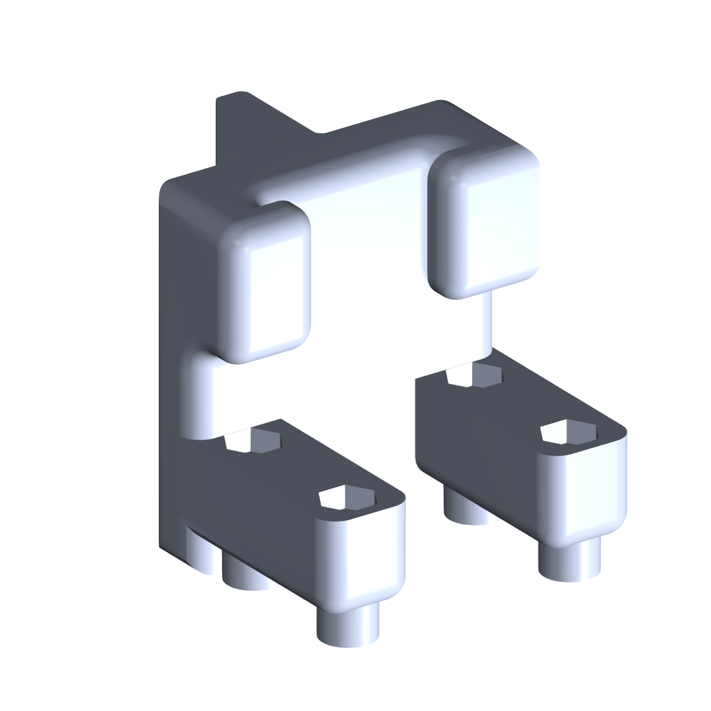

# Raspberry Pi Camera Mount

Mount for a Raspberry Pi Camera Module 3. Bolts onto the
[OT2 backboard](../ot2_backboard/).

## Files

| File | Purpose |
| --- | --- |
| `RaspberryPiCameraMount.stl` | Printable camera housing. |
