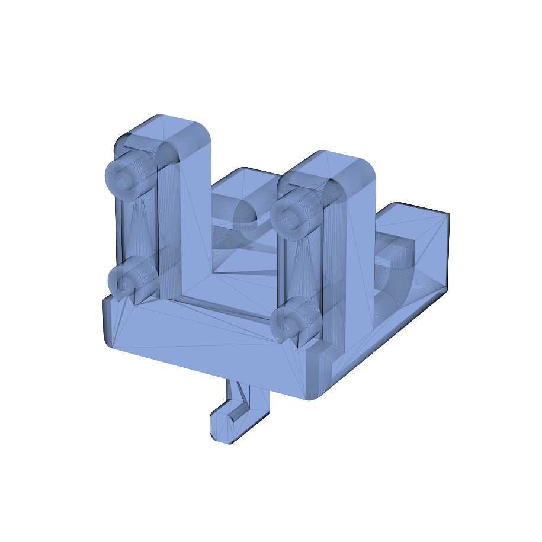

# Raspberry Pi Camera Mount

Mount for a Raspberry Pi Camera Module 3. Bolts onto the
[OT2 backboard](../ot2_backboard/).

## Files

| File | Purpose |
| --- | --- |
| `PAW-V2 - Raspberry Pi Camera Module 3 Mount_REV. 0 Copy 1 - Part 1.stl` | Printable camera housing. |
