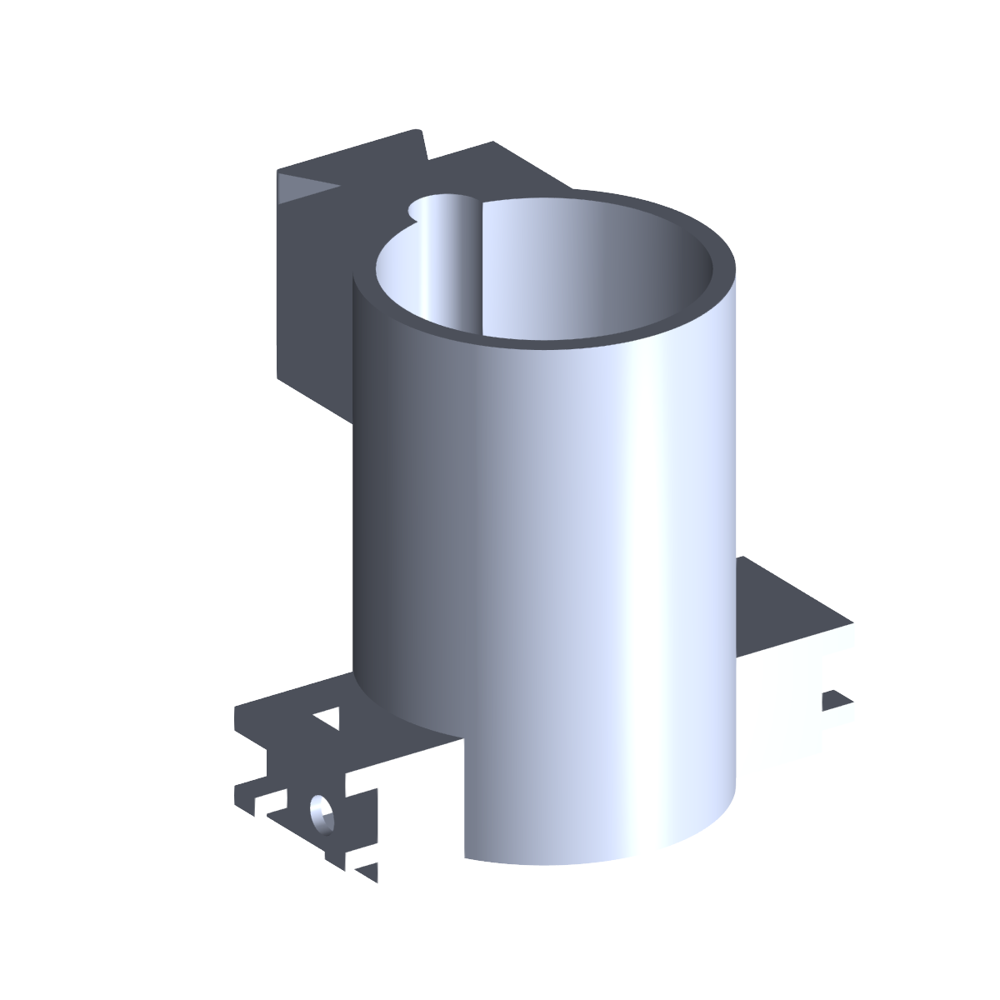

# Vial Decapper Mount

Mount that holds the electromagnet used to drive the vial decapper.
Bolts onto the [OT2 backboard](../ot2_backboard/).

## Files

| File | Purpose |
| --- | --- |
| `VialDecapperMount.stl` | Printable electromagnet housing. |
